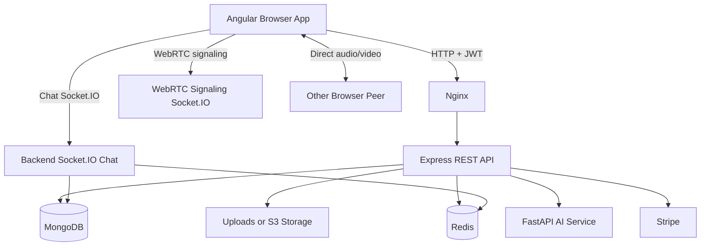

# BoniCare Application Overview

## 1. What BoniCare Is

BoniCare is a telemedicine platform designed for orthopedic care. It connects patients with doctors and supports the complete care workflow:

1. A patient creates an account and signs in.
2. The patient discovers doctors and books an appointment.
3. The patient manages personal health information and medical files.
4. The doctor reviews appointments and professional profile information.
5. The patient and doctor can conduct a video consultation.
6. They can exchange text messages during the consultation.
7. AI services can analyze supported medical data, such as bone X-ray images or lower-back feature data.
8. Payments, notifications, and operational infrastructure support the clinical workflow.

The application is both a healthcare product and a cloud-native engineering project. The product layer serves patients and doctors, while the DevOps layer packages, deploys, monitors, and scales the services.

## 2. Main User Roles

### Patient

Patients can:

- Register and sign in.
- View a patient dashboard.
- Update their profile.
- Browse doctors.
- View doctor availability.
- Book and cancel appointments.
- Upload medical files.
- View their uploaded-file metadata.
- Delete their uploaded files.
- Use supported AI analysis features.
- Start or join video consultations.
- Exchange text messages with the doctor in an appointment room.
- Manage notification preferences.
- Complete supported Stripe payment flows.

### Doctor

Doctors can:

- Sign in through the same authentication system.
- View and update their professional profile.
- Manage availability slots.
- View patient appointments.
- Cancel appointments where authorized.
- Join scheduled video consultations.
- Exchange text messages with patients during an appointment.
- Access shared application features according to their role permissions.

### Administrator

The frontend contains an admin dashboard shell and role-aware routing. The complete administrator API is not yet implemented. Full administrative functionality is therefore a remaining product area rather than a completed feature.

## 3. User-Facing Features

### Authentication

The authentication workflow is handled by the backend and Angular frontend:

- Signup with name, email, password, phone, and role.
- Login with email and password.
- JWT-based session authentication.
- Role-based access for patient, doctor, and admin routes.
- Guest protection for authentication pages.
- Automatic handling of unauthorized sessions.

The frontend stores the JWT and a user snapshot locally, then attaches the token to protected API requests.

### Patient Dashboard

The patient dashboard provides a summary of:

- Medical files.
- AI reports.
- Appointments.
- Patient profile information.
- Recent appointments and report activity.

The dashboard also provides links to the main patient workflows.

### Patient Profile

Patients can view and update:

- Name.
- Phone number.
- Date of birth.
- Gender.
- Medical history.

The backend stores account fields in the `User` document and patient-specific fields in the `Patient` document. The profile update endpoint updates both records in one authenticated workflow.

Implemented endpoints:

```text
GET /api/v1/patient/profile
PUT /api/v1/patient/profile
```

### Doctor Profile and Availability

Doctors have a professional profile containing fields such as:

- Specialty.
- Biography.
- License number.
- Years of experience.
- Hospital information.
- Approval state where applicable.

Doctors can create and delete availability slots. Patients use availability data when booking appointments.

### Appointments

Appointment features include:

- Listing available doctors.
- Loading doctor availability.
- Booking an appointment.
- Viewing patient appointments.
- Viewing doctor appointments.
- Cancelling appointments.
- Detecting overlapping doctor appointments.
- Sharing the appointment ID as the common room identity for video and chat.

Important appointment statuses include:

- `scheduled`
- `completed`
- `cancelled`
- `no-show`
- `awaiting_payment`
- `payment_failed`

Implemented endpoint examples:

```text
GET  /api/v1/appointment/doctors
GET  /api/v1/appointment/doctors/:doctorId/availability
POST /api/v1/appointment/book
GET  /api/v1/appointment/my-appointments
PUT  /api/v1/appointment/:id/cancel
GET  /api/v1/doctor/appointments
```

### Medical Files

Patients can upload supported medical documents, including:

- JPEG images.
- PNG images.
- WebP images.
- PDF documents.
- DICOM files where supported by the backend validator.

The upload flow includes:

1. File type validation in the frontend.
2. File-size validation in the frontend.
3. Multipart upload through Angular `HttpClient`.
4. Multer processing in Express.
5. Physical file storage under the backend `uploads/` directory for local development.
6. Medical-file metadata persistence in MongoDB.
7. Patient-scoped file listing.
8. Patient-scoped deletion of both the file and its metadata.

Implemented endpoints:

```text
POST   /api/v1/files/upload
GET    /api/v1/files
GET    /api/v1/files/:filename
DELETE /api/v1/files/:filename
```

The actual file is stored separately from MongoDB. MongoDB stores metadata such as filename, original name, MIME type, size, patient, uploader, modality, body part, and upload date.

### AI Analysis

The AI subsystem is a separate Python service built with FastAPI and TensorFlow-related tooling. Current supported analysis areas include:

- Lower-back analysis using a list of twelve numerical features.
- Bone-fracture analysis using an uploaded image.

The general flow is:

1. The user submits analysis data from Angular.
2. The Express backend communicates with the AI service.
3. The AI service loads the appropriate trained model.
4. The model returns a prediction, label, confidence, or probabilities.
5. The backend can persist AI report data for dashboard use.
6. The frontend displays the result and report history where available.

AI is decision support, not a replacement for professional diagnosis. Production work remains for stronger route authorization, ownership checks, failure handling, and full end-to-end report validation.

### Video Consultation

Video consultation uses two separate communication layers:

- Socket.IO signaling.
- Browser-to-browser WebRTC media.

The standalone WebRTC service runs on port `5002` during native development. It coordinates:

- Room joining.
- Peer detection.
- Offer exchange.
- Answer exchange.
- ICE candidate relay.
- Peer join notifications.
- Peer leave notifications.
- Disconnect cleanup.

The signaling server does not carry the video stream. It only exchanges the information required for two browsers to establish a direct WebRTC connection.

The browser uses `getUserMedia()` for camera and microphone access and `getDisplayMedia()` for screen sharing.

The appointment ID is used as the room ID. Therefore, both participants must select the same appointment record.

### In-Call Text Chat

Text chat is handled separately by the backend Socket.IO server:

1. Both users select the same appointment.
2. Both clients join a conversation room using the appointment ID.
3. A message is sent with the appointment ID, sender ID, recipient ID, and content.
4. The backend saves the message in MongoDB.
5. The backend broadcasts the saved message to the room.
6. Optional push notification processing runs independently of live delivery.

The chat interface distinguishes messages visually:

- The current user's messages appear on the right.
- The other participant's messages appear on the left.
- Sender labels identify `You`, `Doctor`, or `Patient`.

### Payments

Stripe is used for payment processing:

- The backend creates Stripe PaymentIntents.
- The frontend uses Stripe.js for the payment interface.
- Stripe webhooks synchronize payment events.
- Authorized roles can perform supported refund operations.

A real Stripe secret key and publishable key must be configured for production or an appropriate test key must be used during development.

### Notifications

The notification subsystem supports:

- Notification preferences.
- Firebase Cloud Messaging token registration.
- Push notification attempts.
- Email notification attempts through Nodemailer.
- Chat-related notification events where configured.

A full notification inbox, unread count, and read-state workflow remain future improvements.

## 4. Application Structure

### Frontend

Location:

```text
apps/bonicare-frontend/
```

Important areas:

```text
src/app/core/
  auth/             Authentication and session state
  guards/           Authentication and role guards
  interceptors/     JWT and HTTP error handling
  layouts/          Auth and main application layouts
  services/         Typed API and Socket.IO clients

src/app/shared/
  models/           TypeScript API contracts
  pipes/            Date and status formatting
  ui/               Reusable buttons, cards, badges, inputs, and skeletons

src/app/features/
  auth/             Login and signup
  patient/          Patient dashboard and profile
  doctor/           Doctor dashboard and availability
  appointments/     Booking, listing, and cancellation
  medical-files/    Upload and file management
  ai/               AI analysis and reports
  payments/         Stripe payment flow
  notifications/    Notification preferences
  video-consultation/ WebRTC and in-call chat
```

Angular uses standalone components, lazy-loaded feature routes, injectable services, and Signals for local reactive state.

### Backend

Location:

```text
apps/bonicare-backend/
```

Important areas:

```text
server.js
  Express application startup, middleware, routes, health endpoint, and backend Socket.IO

src/controllers/
  Business logic for users, patients, doctors, appointments, files, AI, payments, and notifications

src/routes/
  REST endpoint registration

src/models/
  Mongoose schemas for users, patients, appointments, files, reports, messages, and payments

src/middleware/
  Authentication, validation, upload processing, and error handling

src/services/
  Shared services such as messages, files, AI clients, and notifications

src/validators/
  Request validation using express-validator
```

The backend exposes versioned REST APIs under:

```text
/api/v1
```

It also owns the persistent chat Socket.IO server.

### AI Service

Location:

```text
apps/ai-service/
```

The service uses:

- FastAPI for HTTP endpoints.
- Uvicorn as the application server.
- TensorFlow for the fracture model.
- Scikit-learn/pickle for the lower-back model.
- NumPy and Pandas for numerical processing.
- Pillow for image processing.
- Multipart upload handling for image analysis.

### WebRTC Signaling Service

Location:

```text
apps/webrtc/
```

This is a small Node.js and Socket.IO service dedicated to signaling. It is intentionally separate from the main backend so real-time media negotiation can evolve independently from REST business logic and persistent chat.

## 5. Technology Interaction



### Request and data flow

- Angular sends REST requests to Express.
- The JWT interceptor adds authentication headers.
- Express middleware validates authentication and role permissions.
- Controllers apply business rules.
- Mongoose reads and writes MongoDB documents.
- Redis supports Socket.IO scaling and room messaging.
- Uploaded binaries go to file storage while metadata goes to MongoDB.
- The backend calls FastAPI for AI analysis.
- Stripe handles external payment processing.
- WebRTC signaling exchanges connection data, while media flows directly between browsers.

## 6. Security Model

Current protections include:

- JWT authentication.
- Role-based route guards.
- Patient-scoped medical-file listing and deletion.
- Validation of profile and file-upload inputs.
- Angular output sanitization.
- Protected patient and doctor API routes.
- No password hash in patient profile responses.

Important remaining hardening areas include:

- Protecting and ownership-checking every AI endpoint.
- Authorizing WebRTC room joins against the appointment participants.
- Restricting production CORS origins.
- Adding rate limiting.
- Adding TURN authentication/configuration for production WebRTC.
- Moving production uploads to durable cloud storage.
- Adding refresh-token rotation.

## 7. Local Development Modes

### Native mode

Run the services separately:

```bash
cd apps/bonicare-backend
npm install
npm run dev
```

```bash
cd apps/bonicare-frontend
npm install
npm start
```

```bash
cd apps/webrtc
npm install
npm start
```

Typical local URLs:

```text
Frontend:          http://localhost:4200
Backend API:       http://localhost:3000/api/v1
Backend health:    http://localhost:3000/health
WebRTC signaling:  http://localhost:5002
AI service:        http://localhost:8000
MongoDB:           mongodb://127.0.0.1:27017
Redis:             redis://127.0.0.1:6379
```

### Docker mode

Docker Compose runs the frontend, backend, MongoDB, Redis, AI service, and WebRTC service together on a shared network. In Docker, services communicate using service names such as `backend`, `mongo`, `redis`, and `ai-service` rather than `localhost`.

The frontend is served through Nginx, which proxies API and Socket.IO traffic to the internal services.

## 8. Deployment and DevOps Structure

### Docker

Each major service has its own Dockerfile. Docker provides repeatable packaging and isolates runtime dependencies.

### Docker Compose

Compose is used for local orchestration. It starts infrastructure dependencies before application services and defines health checks, networks, volumes, and environment variables.

### Kubernetes

Kubernetes manifests define deployments and services for cloud orchestration. Kubernetes is intended to provide service discovery, restart behavior, replica management, and horizontal scaling.

### Ansible

Ansible playbooks automate server preparation, Docker installation, deployment, update, rollback, monitoring, and security configuration.

### Jenkins

Jenkins automates CI/CD activities such as building images, running checks, and deploying application versions.

### Monitoring

Prometheus collects metrics and Grafana presents dashboards. Additional monitoring configuration supports logs, traces, container metrics, and alerting.

## 9. Current Limitations and Next Improvements

The application is functional for its core MVP workflows, but the following areas remain important:

1. Add strong authentication and ownership checks to AI endpoints.
2. Authorize WebRTC room membership using the appointment participants.
3. Configure a TURN server for calls across restrictive networks.
4. Use S3-compatible or shared persistent storage for production medical files.
5. Add automated two-browser WebRTC and chat tests.
6. Complete backend Jest baseline verification.
7. Add appointment filtering and pagination.
8. Add payment history APIs.
9. Complete notification inbox and read-state APIs.
10. Complete admin APIs and doctor approval workflows.
11. Add refresh-token support and password reset.
12. Align Swagger, README, and implementation details continuously.

## 10. Core Concept in One Sentence

BoniCare is a role-based orthopedic telemedicine platform in which Angular provides the clinical user experience, Express manages authenticated healthcare workflows, MongoDB stores clinical metadata, AI evaluates supported medical inputs, Socket.IO enables chat and signaling, WebRTC carries live media between browsers, and DevOps infrastructure packages and operates the system reliably.
