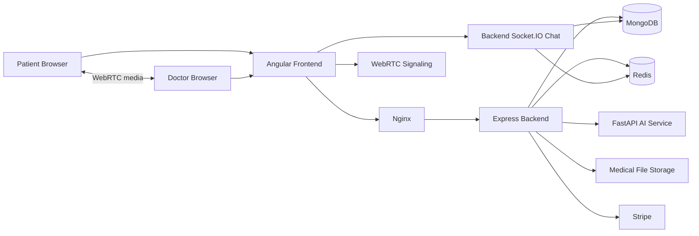

# BoniCare
# The Digital Orthopedic-Care Platform

### Presentation structure

```text
01  PROBLEM
   ↓
02  IDEA
   ↓
03  USER JOURNEY
   ↓
04  BUSINESS IMPACT
   ↓
05  DIFFERENTIATION
   ↓
06  TECHNICAL ARCHITECTURE
   ↓
07  CLOUD & DEVOPS
   ↓
08  PROGRESS TO DATE
   ↓
09  FUTURE ROADMAP
   ↓
10  CLOSING
```

---

# 01  PROBLEM
## Orthopedic care is fragmented

Patients and doctors often depend on disconnected tools for:

- Finding a specialist.
- Booking appointments.
- Sharing X-rays, MRI scans, and medical reports.
- Communicating before and after a consultation.
- Conducting remote video visits.
- Processing payments.
- Coordinating reminders and follow-up care.

### The consequences

- Patients repeat the same information and resend medical documents.
- Doctors spend time coordinating administration instead of focusing on care.
- Clinics lack a single view of the patient journey.
- Important information is scattered across email, messaging apps, paper documents, and unrelated systems.
- Remote consultations are difficult to connect to the rest of the clinical workflow.
- Existing general-purpose tools are not designed around orthopedic care.

### Core problem statement

> Orthopedic care needs a connected digital workflow that brings appointments, records, communication, remote consultation, and decision support together in one trusted experience.

### Speaker message

The problem is not simply the absence of video calling. The deeper problem is fragmentation across the entire care journey.

---

# 02  IDEA
## BoniCare connects the orthopedic-care journey

BoniCare is a role-based telemedicine platform designed for orthopedic care.

It connects:

- Patients.
- Doctors.
- Appointments.
- Medical files.
- AI-assisted analysis.
- Video consultations.
- Text chat.
- Payments.
- Notifications.

### What BoniCare enables

For patients:

- Find doctors and book care.
- Manage their profile and medical information.
- Upload and organize medical files.
- Meet doctors through video consultation.
- Chat in the context of an appointment.
- Use supported AI analysis features.
- Manage payment and notification workflows.

For doctors:

- Publish professional information.
- Define availability.
- Manage appointments.
- Review patient-provided files.
- Conduct video consultations.
- Communicate with patients in an appointment room.

### Product promise

> One connected platform for a more organized, accessible, and continuous orthopedic-care experience.

---

# 03  USER JOURNEY
## From appointment discovery to continuous care

### Patient journey

1. **Register and sign in**
   - The patient creates an account and receives a secure authenticated session.

2. **Discover a doctor**
   - The patient views available doctors and their availability.

3. **Book an appointment**
   - The patient selects a suitable date and time.
   - The system detects scheduling conflicts.

4. **Prepare for the consultation**
   - The patient updates their profile.
   - The patient uploads X-rays, PDFs, or other supported medical files.

5. **Pay when required**
   - Stripe supports payment processing for eligible appointments.

6. **Consult remotely**
   - The patient and doctor join the same appointment room.
   - Video and audio use browser-based WebRTC.

7. **Communicate during care**
   - Both participants use appointment-linked text chat.
   - Messages are persisted and delivered to both participants.

8. **Use decision support**
   - Supported images or structured data can be submitted to the AI service.
   - Results are presented as decision support, not as an autonomous diagnosis.

9. **Continue care**
   - Appointments, files, reports, and profile information remain organized for future interactions.

### Doctor journey

1. Create or access a professional profile.
2. Define availability.
3. Receive and manage patient appointments.
4. Review relevant patient-provided information.
5. Join the appointment-specific video room.
6. Communicate through the appointment chat.
7. Continue care through future appointments and follow-up workflows.

### Why this journey matters

Every step is connected to the same patient, doctor, and appointment context. This reduces duplication and makes the transition from scheduling to consultation more natural.

---

# 04  BUSINESS IMPACT
## Value for every participant in the healthcare ecosystem

### Patient value

- Easier access to orthopedic specialists.
- Less administrative effort.
- One place for appointments and medical documents.
- More convenient remote consultations.
- Better continuity between visits.
- Clearer communication with the care provider.

### Doctor value

- Less time spent coordinating appointments.
- Structured availability and scheduling.
- Better access to patient-provided information.
- Integrated video and chat instead of disconnected tools.
- More opportunities to provide remote follow-up care.

### Clinic value

- A digital patient portal without building every component internally.
- More organized operations.
- Potentially fewer missed appointments.
- Better visibility into appointment and consultation activity.
- A foundation for multi-doctor and multi-location growth.

### Business value

BoniCare can create value through:

- Clinic subscriptions.
- Per-consultation fees.
- Hybrid subscription and usage pricing.
- White-label deployments.
- Enterprise integrations.
- Premium AI-assisted analysis services after clinical validation.

### Technical business enablers

The commercial model is supported by technical capabilities that make the product repeatable and scalable:

- **Shared platform services** reduce the cost of launching each new clinic.
- **Role-based access** allows one platform to serve patients, doctors, clinic staff, and future administrators.
- **Appointment IDs as workflow context** connect scheduling, files, video, and chat without requiring separate coordination systems.
- **Usage-based boundaries** make it possible to price appointments, storage, AI requests, and video usage separately.
- **Health checks and observability** reduce operational risk and support service-level commitments.
- **Containerized services** make deployments repeatable across pilot, clinic, and enterprise environments.
- **API-based architecture** makes future integrations with clinic systems and identity providers possible.

### Economic model behind the product

Revenue can scale through subscriptions and usage while costs can be measured by:

- Active doctors and patients.
- Completed consultations.
- Video minutes and TURN bandwidth.
- Stored medical-file volume.
- AI inference requests.
- Notification and email volume.

This allows pricing to reflect actual infrastructure consumption instead of offering unlimited high-cost usage by default.

### Business impact statement

> BoniCare turns fragmented orthopedic administration into a connected digital service that can improve access, efficiency, continuity, and scalability.

---

# 05  DIFFERENTIATION
## Why BoniCare instead of separate existing tools?

A clinic could combine:

- A calendar application.
- A messaging application.
- A video-conferencing tool.
- Cloud storage.
- A payment provider.
- A separate AI product.
- Spreadsheets or another system for patient tracking.

That approach creates a collection of tools, not a connected care workflow.

### Problems with the separate-tools approach

- Patient identity and appointment context must be synchronized manually.
- Medical files are separated from the consultation where they are needed.
- Chat history is disconnected from the appointment.
- Video links may be created and shared manually.
- Doctors switch between multiple interfaces.
- Clinics manage several vendors, contracts, and support channels.
- Important data can become duplicated or inconsistent.
- The patient experience feels fragmented.

### BoniCare's differentiation

1. **Orthopedic specialization**
   - The product is designed around orthopedic appointments, records, and remote care.

2. **Appointment-centered workflow**
   - The appointment provides the shared context for video, chat, and future clinical workflows.

3. **Integrated medical-file management**
   - Patient files are connected to the patient account and can support consultation and AI workflows.

4. **Integrated communication**
   - Video and text chat are part of the care journey rather than isolated tools.

5. **AI-assisted capability**
   - Supported lower-back and bone-fracture analysis can be integrated into the same platform.

6. **Flexible deployment**
   - The architecture supports native development, Docker Compose, and cloud-oriented Kubernetes deployment.

7. **One operational view**
   - Patients, doctors, and clinics can work from the same platform model.

### Technical and commercial advantage

Using separate tools creates integration work and recurring coordination costs. BoniCare centralizes the shared business identity around the appointment:

```text
Patient + Doctor + Appointment ID
              ↓
     Files + Chat + Video + Payment + AI context
```

This reduces the need to build and maintain custom links between multiple vendors. It also creates a more consistent data model for reporting, support, billing, and future integrations.

### Total-cost-of-ownership advantage

BoniCare can reduce operational complexity by providing:

- One user and role model.
- One appointment context.
- One integration surface for core workflows.
- One monitoring and deployment model.
- One place to apply security policies and audit controls.

The platform does not eliminate third-party costs. Stripe, email, Firebase, cloud storage, compute, and video-network infrastructure remain variable costs. Its advantage is reducing the cost and inconsistency of coordinating them independently.

### Differentiation statement

> Separate tools provide separate functions. BoniCare connects those functions around the orthopedic appointment and patient journey.

---

# 06  TECHNICAL ARCHITECTURE
## A modular cloud-native architecture

### Frontend

**Angular 19 and TypeScript** provide:

- Patient and doctor interfaces.
- Lazy-loaded feature areas.
- Role-aware routing.
- Reactive forms.
- Typed API clients.
- Responsive SCSS styling.
- Local state using Angular Signals.

### Backend

**Node.js and Express.js** provide:

- Versioned REST APIs under `/api/v1`.
- Authentication and role-based authorization.
- Appointment and profile business logic.
- Medical-file processing.
- AI-service integration.
- Stripe integration.
- Notification services.
- Persistent Socket.IO chat.

### Data layer

**MongoDB and Mongoose** store:

- Users.
- Patient profiles.
- Doctor profiles.
- Appointments.
- Medical-file metadata.
- AI reports.
- Chat messages.
- Payments and notifications.

**Redis** supports real-time infrastructure and Socket.IO scaling.

### Medical-file storage

- Multer receives uploads.
- Local development stores files under the backend `uploads/` directory.
- MongoDB stores metadata and ownership information.
- Production should use durable S3-compatible or shared object storage.

### AI service

**FastAPI and Python** provide:

- Lower-back model inference from twelve numerical inputs.
- Bone-fracture image inference.
- Health checks for model availability.
- TensorFlow, scikit-learn, NumPy, Pillow, and multipart upload support.

### Video consultation

**WebRTC** carries browser-to-browser audio and video.

A separate **Node.js and Socket.IO signaling service** exchanges:

- Room membership.
- Offers.
- Answers.
- ICE candidates.
- Peer join and leave events.

The signaling service coordinates the connection; it does not carry the media stream.

### Payments and notifications

- Stripe handles PaymentIntents and supported refunds.
- Firebase supports push-notification foundations.
- Nodemailer supports email notification foundations.

### Technical architecture flow



---

# 07  CLOUD & DEVOPS
## How the platform is operated reliably

### Containerization

- Each major service has its own Dockerfile.
- Docker packages application code and runtime dependencies consistently.
- Containers reduce differences between developer, test, and deployment environments.

### Local orchestration

Docker Compose runs the complete local platform:

- Angular frontend and Nginx.
- Express backend.
- MongoDB.
- Redis.
- FastAPI AI service.
- WebRTC signaling service.

Compose also defines networks, health checks, environment variables, service dependencies, and persistent volumes.

### Cloud orchestration

Kubernetes is used as the cloud deployment target for:

- Service discovery.
- Replica management.
- Restart and recovery behavior.
- Horizontal scaling.
- Separation of application and infrastructure configuration.

### Automation

- **Ansible** automates server preparation, Docker installation, deployment, updates, rollbacks, monitoring, and security configuration.
- **Jenkins** provides the CI/CD foundation for building, testing, packaging, and deploying services.

### Observability

- **Prometheus** collects service and infrastructure metrics.
- **Grafana** presents operational dashboards.
- Logging, tracing, container metrics, and alerting configurations support troubleshooting and reliability.

### Cloud-readiness priorities

- Use durable object storage for medical files.
- Configure TURN infrastructure for WebRTC across restrictive networks.
- Protect secrets through cloud secret management.
- Add backups and disaster recovery.
- Connect technical monitoring to business KPIs such as consultation completion and appointment success.

### Technical operating economics

The main variable cost drivers are:

- Video traffic and TURN relay bandwidth.
- Medical-file storage and data transfer.
- AI model inference time and compute.
- Database, Redis, and log retention capacity.
- Email, push notification, and payment-provider usage.

The platform should monitor these costs per clinic and per completed consultation. This supports margin analysis, fair-use limits, and package design.

### Commercial reliability targets

Technical service objectives should be translated into customer-facing commitments:

- API availability and response time.
- Appointment booking success rate.
- Video connection success rate.
- Chat delivery success rate.
- Medical-file upload success rate.
- AI service availability and response time.
- Recovery time after service failure.

These measurements turn infrastructure monitoring into evidence for clinic renewals and enterprise service-level agreements.

---

# 08  PROGRESS TO DATE
## What has been built

### Core platform

- JWT authentication and role-based access.
- API versioning.
- Patient and doctor workflows.
- Appointment booking and cancellation.
- Doctor profile and availability management.
- Patient profile read/update management.

### Medical files

- File upload.
- File validation.
- MongoDB metadata persistence.
- Patient-scoped listing.
- Patient-scoped deletion.

### Communication

- Appointment-room text chat.
- Message persistence.
- Two-party WebRTC signaling.
- Offer and answer exchange.
- ICE candidate exchange.
- Peer join and leave handling.
- Camera, microphone, and screen sharing controls.
- Reconnection and cleanup handling.
- Chat UI with distinct incoming and outgoing messages.

### AI and payments

- FastAPI AI service.
- Lower-back classification endpoint.
- Bone-fracture image endpoint.
- AI report persistence foundations.
- Stripe PaymentIntent integration.
- Webhook and refund foundations.

### DevOps foundation

- Service Dockerfiles.
- Docker Compose environments.
- Health checks.
- Kubernetes manifests.
- Ansible deployment automation.
- Jenkins CI/CD foundation.
- Monitoring and observability configuration.

### Current status

The core MVP workflows are functional in native development: authentication, profiles, appointments, files, AI foundations, payments, WebRTC signaling, and appointment-room chat.

### Commercial readiness status

- **Product readiness:** Core patient and doctor workflows are demonstrable.
- **Technical readiness:** Native services and Docker/cloud deployment foundations exist.
- **Operational readiness:** Health checks, monitoring configuration, and deployment automation exist.
- **Commercial readiness:** Controlled clinic pilots are the next practical validation step.
- **Production readiness:** TURN, durable medical-file storage, stronger authorization, automated browser testing, and compliance work remain.

---

# 09  FUTURE ROADMAP
## From working MVP to production platform

### Immediate priorities

1. Verify the complete backend test baseline.
2. Add automated two-browser WebRTC and chat tests.
3. Add strong authentication and ownership checks to AI endpoints.
4. Authorize WebRTC room membership using appointment participants.
5. Add TURN infrastructure for reliable calls across restrictive networks.

### Product priorities

- Complete admin APIs and doctor approval workflows.
- Add payment history and invoice workflows.
- Add notification inbox, unread count, and read-state actions.
- Add appointment filtering, rescheduling, and completion workflows.
- Add pagination for files, reports, appointments, and messages.
- Add password reset and refresh-token workflows.

### Production priorities

- Move medical files to durable cloud object storage.
- Restrict CORS and strengthen API security.
- Add rate limiting and audit logging.
- Formalize backups and disaster recovery.
- Validate AI models clinically and document model limitations.
- Connect monitoring dashboards to business and clinical KPIs.
- Align Swagger, implementation, and operational documentation.

---

# 10  CLOSING
## One connected orthopedic-care workflow
- Jenkins CI/CD foundation.
- Monitoring and observability configuration.


> BoniCare is building more than a telemedicine feature. It is building a connected orthopedic-care workflow: access, appointment, record, communication, consultation, decision support, payment, and follow-up in one platform.
